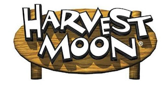

# HarvestMoon 1.0 - master branch (pre-pre-pre-alpha of UWP)

Planned Xbox One's HarvestMoon "remake" (UWP).

## Preface

" This game was the start of a harvest moon clone using XNA. Both me and my fiance love harvest moon and we wanted to
take it further to include trapping and hunting etc. " - Steve Anderson (Mar, 23 2013)

## Screenshots

## Status
- Slow porting to UWP
- Only Map Editor reconstructed at now
- Game runs but game content is not all / full (i.e., no some "containers"?...)
- To be continued... I hope :)

## References
- https://github.com/stevemanderson/azureacres Original HarvestMoon-like project (azureacres codename)
- https://github.com/stevemanderson Steve Anderson, cool C# / XNA / monogame developer 
- https://cas-gamers.blogspot.com/2015/07/harvest-moon-snes-maps-and-locations.html?m=1 Harvest Moon resources

## ..
As is. No support. RnD only. DIY.

## .
[M][E] 2025

